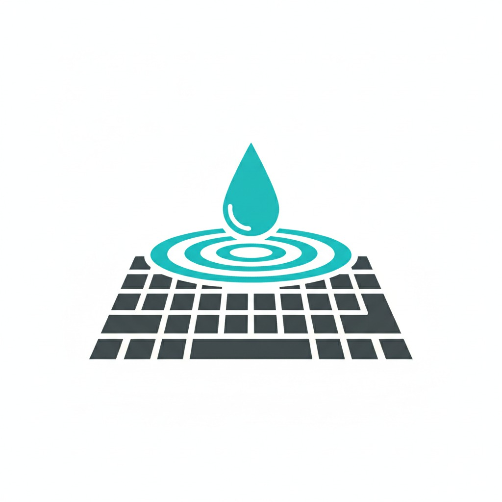

# RippleFX: A High-Performance C++ Keyboard Lighting Engine

RippleFX is a lightweight, hardware-agnostic C++ engine for creating dynamic, real-time lighting effects on keyboards. This project demonstrates a professional, firmware-first approach to software design, prioritizing efficiency, modularity, and portability.

The primary demo effect is a highly customizable, propagation-based "ripple" that is generated in response to user input.

## 🚀 Core Architectural Features

This engine was built from the ground up with professional software architecture principles in mind, making it powerful, flexible, and easy to extend.

### Hardware Abstraction Layer (HAL)
The core logic of the engine is **100% hardware-independent**. It is built as a portable `Core` library that communicates with hardware through a clean interface (`IHardware`). This design allows the engine to run on virtually any keyboard or custom microcontroller with a simple "adapter" class.

This repository includes two pre-built hardware backends:
1.  A **Console Simulator** for easy testing and development without physical hardware.
2.  A **Logitech G213 Adapter** that runs on Windows via the official Logitech LED SDK.

### Modular and Extensible Effects System
Effects are self-contained modules that implement a simple `IEffect` interface. This makes the engine incredibly scalable—new animations like waves, audio visualizers, or fire effects can be added without modifying the core engine at all.

### Designed for Firmware Efficiency
Every design decision was made with the constraints of a microprocessor (like an ESP32) in mind. The engine is optimized for maximum performance and minimal resource usage.

---

## ⚡ Performance Optimizations

The engine employs several advanced optimization techniques to ensure real-time performance with minimal CPU and memory overhead.

#### 1. Cellular Automata for Effect Propagation
Instead of expensive, per-frame distance calculations, effects are propagated using a cellular automata model. Each key "communicates" its state to its pre-calculated neighbors. This is achieved by:
*   **Manhattan Distance**: Used for an initial, one-time calculation of each key's neighbors.
*   **Pointer-Based Neighbors**: Each `Key` object holds pointers to its neighbors, allowing for lightning-fast, cache-friendly propagation without any searching.

#### 2. Elimination of Multiplication & Division
All performance-critical code paths have been optimized to avoid slow multiplication and division operations, replacing them with bitwise shifts.
*   **Integer-Based Brightness Scaling**: The `Color::scale()` method uses integer multiplication and a fast bit-shift (`>> 8`) to approximate division by 255.
*   **Optimized SDK Conversions**: When converting color values to the 0-100 percentage required by the Logitech SDK, a bitwise approximation of `(value * 100) / 256` is used.

#### 3. High-Performance Memory Management
To avoid unpredictable and slow heap allocations in the main loop, the engine uses a **Memory Pool (`EffectPool`)**.
*   All memory for effect objects is pre-allocated at startup.
*   Creating and destroying effects is a near-instantaneous operation that simply takes from and returns to this pool, preventing memory fragmentation and ensuring deterministic performance suitable for real-time firmware.

#### 4. Discrete Fade States
Instead of calculating a gradual fade (which would require division), the ripple effect uses three discrete brightness states (`Ignited`, `Fading_High`, `Fading_Low`). This provides a visually appealing fade effect with zero computational cost in the rendering loop.

---

## ⚖️ Licensing and Commercial Use

This project is licensed under the **Creative Commons Attribution-NonCommercial-ShareAlike 4.0 International (CC BY-NC-SA 4.0) License**. You can find the full license text in the `LICENSE` file.

**In simple terms, this means:**

*   ✅ **You are free to:**
    *   **Share** — copy and redistribute the material in any medium or format.
    *   **Adapt** — remix, transform, and build upon the material.
*   📋 **Under the following terms:**
    *   **Attribution (BY):** You must give appropriate credit to the original author, Michele Bisignano, and link back to this repository.
    *   **NonCommercial (NC):** You may **NOT** use this material for commercial purposes (e.g., selling a product that includes this code).
    *   **ShareAlike (SA):** If you remix, transform, or build upon the material, you must distribute your contributions under the same license as the original.

**For Commercial Use:**
If you wish to use this code in a commercial product, you must contact the original author, Michele Bisignano, to negotiate and purchase a separate commercial license.

---

## 🔧 How to Build and Run

This project uses CMake for building.

### Prerequisites
*   A C++17 compatible compiler (e.g., MSVC, GCC, Clang)
*   CMake (version 3.10 or higher)
*   **For Logitech Hardware**:
    *   Windows OS
    *   Logitech G HUB software installed and running.
    *   The "Allow Games & Applications to control my illumination" setting enabled in G HUB.
    *   The Logitech LED SDK (place the `.h` and `.lib` files in the `vendor/Logitech` directory).

### Build Instructions
1.  Clone the repository: `git clone ...`
2.  Create a build directory: `mkdir build && cd build`
3.  Configure the project: `cmake ..`
4.  Build the executable: `cmake --build .`

### Running the Application
The executable will be located in the `build` directory. Simply run it from your terminal. In `src/main.cpp`, you can choose between the `Simulator` and `LogitechLed` hardware backends.

---

## 🔌 Extending the Engine

### Adding Support for Your Keyboard
1.  Create a new class that inherits from `IHardware` (e.g., `MyKeyboard.h`).
2.  Implement the virtual functions to connect to your hardware's SDK.
3.  In `main.cpp`, create an instance of your new class instead of `LogitechLed`.

### Porting to a Microcontroller (e.g., ESP32)
1.  Create a new project for your target platform (e.g., an Arduino or PlatformIO project).
2.  Copy the entire `Core` library into the new project.
3.  Write a new `main.ino` that uses a non-blocking `loop()` function.
4.  Implement a new `IHardware` class for your specific hardware (e.g., a NeoPixel LED strip).

### Tuning the Ripple Effect
*   **Wave Spread**: If the wave doesn't propagate across the entire keyboard, the issue is the neighbor distance threshold. This can be adjusted in `src/Core/Keyboard/Keyboard.cpp`.
*   **Speed and Duration**: All timing parameters (`stepDuration`, `propagationDelay`, `maxLifetime`) are set in `src/main.cpp` when a new effect is created.
